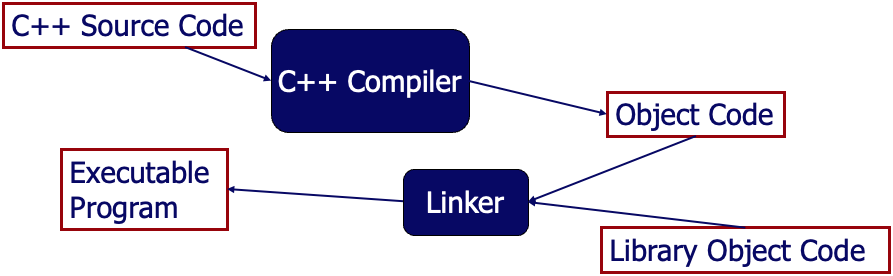
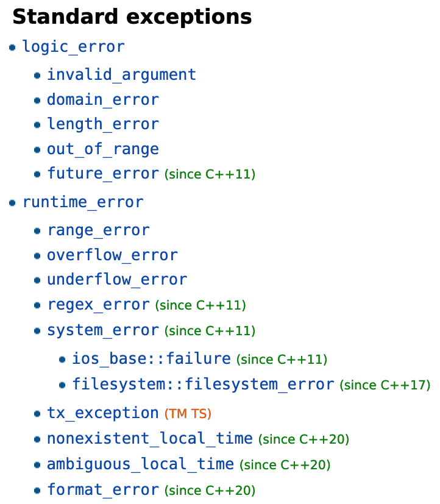
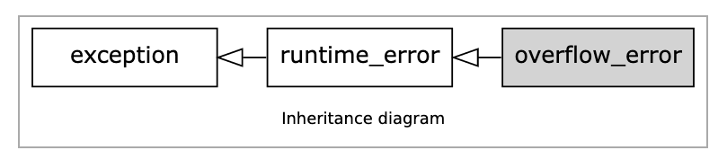
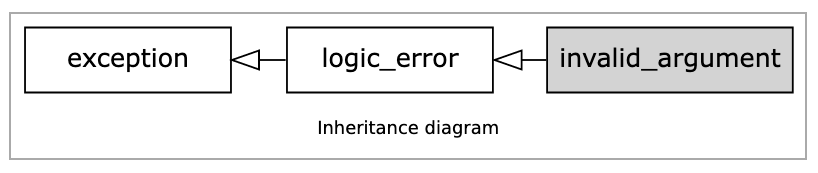
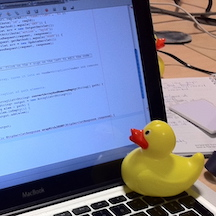
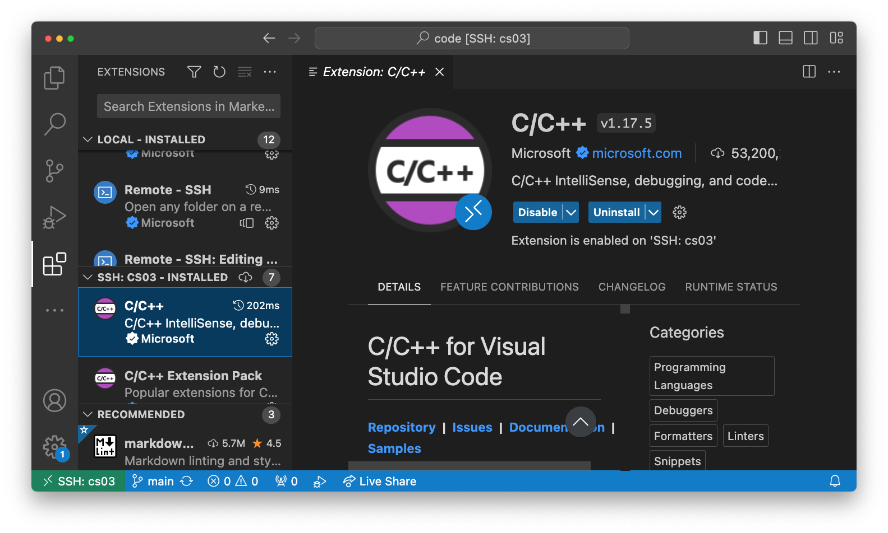
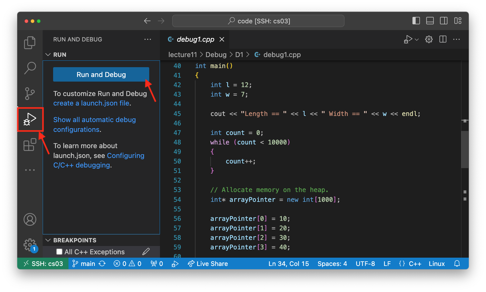
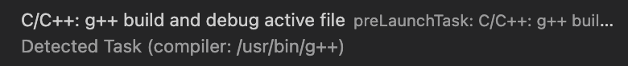
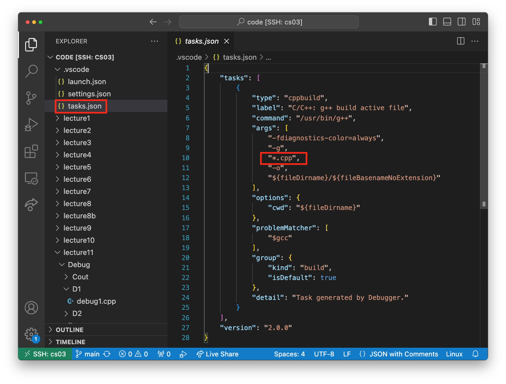

# Lecture 11: Errors and Debugging 


### Objective

 Learn and gain experience with errors and debugging, employ `try`/`catch` for exception handling, and apply debugging techniques including `cout` tracing, rubber duck debugging, and debugger tools to effectively diagnose and resolve programming challenges.


### Lecture Topics

* [Errors](#errors)
    - [Exercise 1](#exercise_1)
* [Debugging](#debugging)
    - [Exercise 2](#exercise_2)

## Errors <a class="anchor" id="errors"></a>

When we write programs, errors are natural and unavoidable; the question is, how do we deal with them?
* Organize software to minimize errors
* Eliminate existing errors with
    - Debugging
    - Testing

“__Avoiding__, __finding__, and __correcting__ errors is __95%__ or more of the effort for serious software development.” – Bjarne Stroustrup

#### Common Sources of Errors

* Poor specification
    - “What’s this supposed to do?”
* Unexpected arguments
    - “but sqrt() isn’t supposed to be called with -1 as its argument”
* Unexpected input
    - “but the user was supposed to input an integer”
* __Code that simply doesn’t do what it was supposed to do__

#### Kinds of Errors

* Compile-time errors
    - Syntax errors 
    - Type errors
* Link-time errors
* Run-time errors
    - Detected by user code (code fails while running)
* Logic errors
    - Detected by programmer (code runs, but produces incorrect output)

__The C++ compilation and linking process__



#### Checking Your Inputs

One way to reduce errors is to validate your inputs.
__Before__ trying to use an input value, check that it meets your expectations/requirements.

For example:
* Function arguments
* Data from input (`istream`, `fstream`)

__inputs.cpp__
```c++
int area(int length, int width)
{
	return length * width;
}

int main()
{
    // error: wrong number of arguments
    int result1 = area(7);	   	    

    // error: 1st argument has a wrong type
    int result2 = area("seven", 2);	

    // ok
    int result3 = area(7, 10);		

    // ok, but dangerous: 7.5 truncated to 7
    // the compiler will warn you if you use
    // the -Wconversion warning option
    int result4 = area(7.5, 10);	
    
    // ok, but this is a difficult case:
    // the types are correct,
    // but the values make no sense
    int result5 = area(10, -7); 	

    return 0;
}
```

#### Bad Function Arguments

What do we do in cases like this, where the types are correct but the values don't make sense:

```c++
int result = area(10, -7); 
```
Alternatives:
* Just don’t do that
    - Hard to control all situations
* The __caller__ of the function can check
    - Get’s messy, and is hard to accomplish systematically

__caller.cpp__
```c++
    // Caller validates the inputs
    if (l <= 0)
    {
        error("Non-positive length value.");
    }
    
    if (w <= 0) 
    {
        error("Non-positive width value.");
    }
    
    int result = area(l, w);

    cout << "Area == " << result << endl;
```

* The __function__ should check
    - Example: Return an “error value” (not general, problematic)

__function.cpp__
```c++
// Returns a negative value for bad input.
int area(int length, int width)     
{
    // Validate the inputs.
	if(length <= 0 || width <= 0)
    { 
        // Return an error value.
        return -1;
    }

	return length * width;
}
```
The caller has to be aware of these special return values.
```c++
int result = area(l, w);

// Check the result for the -1 error return value.
if (result < 0)
{
    error("Bad area computation.");
}
```
For some functions there isn’t a “bad value” to return (e.g., `max()`)

* The __function__ should check
    - Example: Set an error status indicator (not general, problematic, don’t do this)

__status.cpp__
```c++
// Error status indicator.
int error_number = 0;

// Will set error_number to 7 for bad input.
int area(int length, int width)     
{
    // Validate the inputs.
	if(length <= 0 || width <= 0)
    { 
        // Set the error status.
        error_number = 7;
    }

	return length * width;
}
```
The caller has to be aware of the error number values.
```c++
int result = area(l, w);

// Check error_number to see if an error occurred.
if (error_number == 7)
{
    error("Bad area computation.");
}

cout << "Area == " << result << endl;
```
* The __function__ should check!
    - Example: Throw an `exception`

__exception1.cpp__
```c++
// Create a new exception class
class InvalidAreaArgumentsException
{
    // If you don't explicitly define a constructor, 
    // the compiler provides a default constructor 
};


// Will throw an exception on bad input.
int area(int length, int width)     
{
    // Validate the inputs.
	if(length <= 0 || width <= 0)
    { 
        // Throw an exception.
        throw InvalidAreaArgumentsException{};
    }

	return length * width;
}
```
The caller has __the option__ to `catch` the `exception`.
```c++
try 
{
    int result = area(l, w);
    cout << "Area == " << result << endl;
}
catch (InvalidAreaArgumentsException &ex)
{
    cout << "Bad argument to area()" << endl;
}
```

If you don't `catch` an exception it gets passed on along the call stack. 

__exception2.cpp__
```c++
// Will throw an exception on bad input.
int area(int length, int width)     
{
    // Validate the inputs.
	if(length <= 0 || width <= 0)
    { 
        // Throw an exception.
        throw InvalidAreaArgumentsException{};
    }

	return length * width;
}

// Calls the area function after reducing 
// the length and width by frame size.
int framedArea(int length, int width)
{
    int frameSize = 2;

    // Do not catch exception here.
    int result = area(length - frameSize, width - frameSize);

    return result;
}
```

You can create more detailed exceptions that will keep track of variables and have custom messages for reporting errors.

__exception3.cpp__
```c++
#include <iostream>
#include <string>
using namespace std;

// Create a new exception class
class InvalidAreaArgumentsException
{
public:
    InvalidAreaArgumentsException(int l, int w) 
    : length{l}, width{w} 
    { /* Empty constructor block. */ }

    std::string message() 
    {
        return "Bad argument to area(): length == " 
            + std::to_string(length) 
            + " width == "
            + std::to_string(width);
    }
private:
    int length;
    int width;
};

// Will throw an exception on bad input.
int area(int length, int width)     
{
    // Validate the inputs.
	if(length <= 0 || width <= 0)
    { 
        // Throw an exception.
        throw InvalidAreaArgumentsException{length, width};
    }

	return length * width;
}

int main()
{
    int l;
    int w;
    cout << "Enter values for length and width:" << endl;
    cin >> l >> w;
    
    try 
    {
        int result = area(l, w);
        cout << "Area == " << result << endl;
    }
    catch (InvalidAreaArgumentsException &ex)
    {
        cout << exception.message() << endl;
    }

    return 0;
}
```
You could also choose from a selection of pre-defined exception classes in the `<stdexcept>` library.

Reference: [https://en.cppreference.com/w/cpp/error/exception](https://en.cppreference.com/w/cpp/error/exception)




For validating the arguments to the area function it makes sense to throw the `invalid_argument` exception defined in `<stdexcept>`.

__exception4.cpp__
```c++
#include <iostream>
#include <stdexcept>
using namespace std;

// Will throw an exception on bad input.
int area(int length, int width)     
{
    // Validate the inputs.
	if(length <= 0 || width <= 0)
    { 
        // Throw an exception.
        throw invalid_argument{"Bad argument to area()"};
    }

	return length * width;
}

int main()
{
    int l;
    int w;
    cout << "Enter values for length and width:" << endl;
    cin >> l >> w;
    
    try 
    {
        int result = area(l, w);
        cout << "Area == " << result << endl;
    }
    catch (invalid_argument &ex)
    {
        cout << ex.what() << endl;
    }

    return 0;
}
```
Exception should be thrown that describe the error that occurs. You can `catch` multiple types of exceptions and handle each of them differently. In the code below, the `invalid_argument` exception is thrown when bad arguments are passed to the area function, and the `overflow_error` exception is thrown if the multiplication of length and width overflow the maximum size of an integer. The `catch` statements are listed one after another.
__exceptions5.cpp__
```c++
#include <iostream>
#include <stdexcept>
using namespace std;

// Will throw an exception on bad input.
int area(int length, int width)     
{
    // Validate the inputs.
	if(length <= 0 || width <= 0)
    { 
        // Throw an invalid argument exception.
        throw invalid_argument{"Bad argument to area()"};
    }

    int result = length * width;

    // Check for an overflow in the result.
    if (result / length != width)
    {
        // Throw an overflow error exception.
        throw overflow_error{"Overflow occurred in area()"};
    }

	return result;
}

int main()
{
    int l;
    int w;
    cout << "Enter values for length and width:" << endl;
    cin >> l >> w;
    
    try 
    {
        int result = area(l, w);
        cout << "Area == " << result << endl;
    }
    catch (invalid_argument &ex)
    {
        cout << ex.what() << endl;
    }
    catch (overflow_error &ex)
    {
        cout << ex.what() << endl;
    }

    return 0;
}
```
Exceptions in C++ inherit from a base class called `exception`. 

__Overflow Error Exception__


__Invalid Argument Exception__


You can use __polymorphism__ to catch multiple exceptions of different types by catching the parent class `exception`.

__exception6.cpp__
```c++
try 
{
    int result = area(l, w);
    cout << "Area == " << result << endl;
}
catch (exception &ex)
{
    cout << ex.what() << endl;
}
```

You can also check the cpp reference to see if functions you are calling throw exceptions. 

For example: the string to integer `stoi` function. See reference: [https://en.cppreference.com/w/cpp/string/basic_string/stol](https://en.cppreference.com/w/cpp/string/basic_string/stol)


### Exercise 1 <a class="anchor" id="exercise_1"></a>

Your task is to enhance the `factorial.cpp` program in the `Error` directory to handle potential errors gracefully. Here are the steps:

* Check for Negative Inputs: The factorial function is only defined for non-negative integers. Modify the factorial function to check if the input number n is negative. If it is, throw an appropriate exception.

* Handle Potential Overflow: The result of the factorial calculation can grow rapidly for even relatively small input values. Before each multiplication, check if the next multiplication would cause an overflow. If an overflow is detected, throw an appropriate exception. __Hint__: You might find std::numeric_limits<unsigned long long>::max() useful for this check.

```c++
if (result > std::numeric_limits<unsigned long long>::max() / i) 
{
    throw std::overflow_error("Result will overflow.");
}
```

* Catch Exceptions in the main Function: In the main function, use a try-catch block to catch any exceptions thrown from the factorial function. Display an appropriate error message to the user if an exception is caught.

* Test Your Program: Run your program and test it with various input values, including negative numbers and numbers that might cause an overflow, to ensure that your error handling works as expected.

Remember: Proper error handling is essential for building robust and user-friendly software. Take this opportunity to practice identifying potential errors in code and handling them gracefully!

___


## Debugging <a class="anchor" id="debugging"></a>

A __bug__ in computer programming refers to an error, flaw, failure, or fault in a computer program or system that produces an incorrect or unexpected result, or causes it to behave in unintended ways. The term "bug" is said to have been popularized by [Admiral Grace Hopper](https://en.wikipedia.org/wiki/Grace_Hopper) in the 1940s when a moth was found inside a computer relay, causing a fault.


When you have written a program, it will have bugs.
* It will do something, but not what you expected
* How do you find out what it actually does?
* How do you correct it?
* This process is called __debugging__


#### Debugging: Stepping Through a Program
* Carefully follow the program through the specified sequence of steps
* Pretend you’re the computer executing the program
* Does the output match your expectations?
* If there isn’t enough output to help, add a few debug output statements
```c++
cerr << "x == " << x << ", y == " << y << '\n';
```
* When you write the program, insert some checks that variables have “reasonable values”
* Design these checks so that some can be left in the program even after you believe it to be correct
* It’s almost always better for a program to stop than to give wrong results


#### Debugging: Beginnings and Ends
* Pay special attention to beginnings and ends
    - of loops (for/while)
    - of functions
    - of classes (constructor/destructor)
* Did you initialize every variable?
	- To a reasonable value
* Did the function get the right arguments?
	- Did the function return the right value?
* Did you handle the first element correctly?
	- The last element?
* Did you handle the empty case correctly?
	- No elements
	- No input
* Did you open your files correctly?
* Did you actually read that input?
	- Write that output?


#### Debugging: Be Guided By Output
__“If you can’t see the bug, you’re looking in the wrong place”__
* It’s easy to be convinced that you know what the problem is and stubbornly keep looking in the wrong place
* Don’t just guess, be guided by output
	- Work forward through the code from a place you know is right
		* so what happens next? Why?
	- Work backwards from some bad output
 		* how could that possibly happen?

### Types of Debugging

#### Adding `cout` Statements 

* `cout` the values of variables that you are curious about to see what is going on

* `cout` when you enter and exit functions

* `cout` to find where you are in the code

* `cout` to confirm that a class was properly initialized

* `cout` useful diagnostic information


__testarea.cpp__
```c++
#define DEBUG_ON true

// Create a debug function to output only if debug is on.
void debug(string message)
{
    if (DEBUG_ON)
    {
        cerr << message << endl;
    }
}
```

Now you can use the debug function throughout your code without worrying about having to comment out or remove the `cout` statements.  Just turn `DEBUG_ON` to `false`.

```c++
// Calls the area function after reducing 
// the length and width by frame size.
int framedArea(int length, int width)
{
    debug("Begin framedArea");

    int frameSize = 2;

    // Do not catch exception here.
    int result = area(length - frameSize, width - frameSize);

    debug("Return from framedArea with result == " + to_string(result));

    return result;
}
```

Since we used `cerr` in our debug function, another trick is to redirect the `cerr` standard error stream (2) to a log file. 

To redirect `cerr` (which is the standard error stream, or file descriptor 2 in shell terms) to a log file in a bash shell, you can use the following syntax:

```shell
$ ./your_command 2> log.txt

```
For example
```shell
$ ./testarea 2> debug.txt
```
You can also redirect the standard output stream (1) to an output file.
```shell
$ ./testarea 2> debug.txt 1> output.txt
```


#### Rubber Duck Debugging



Link on Wikipedia: [https://en.wikipedia.org/wiki/Rubber_duck_debugging](https://en.wikipedia.org/wiki/Rubber_duck_debugging)

* Talking through code with someone else
* If someone else is not available use a rubber duck or other inanimate object
* Just by talking through your code, step-by-step, will help you realize what is wrong with the code

#### Debugger


##### Setup
First install the C/C++ extension and extension pack from Microsoft.


Next, open a C++ file that you want to debug and click the debugger icon and then click run and debug.


The debugger may ask you to select a compiler.  Select `g++`


If you are debugging a project that has multiple C++ files (.cpp) then you may have to open the file `tasks.json` in the `.vscode` folder and modify the line that says `"${file}",` and change it to `"*.cpp",`



### Exercise 2 <a class="anchor" id="exercise_2"></a>

The program in the `Debug` folder simulates a basic library system where books can be added, borrowed, returned, and listed. There's a runtime error in this program that you will need to find using the VSCode debugger. 

* Run and debug the code in the VSCode debugger. 
* Step through the code until you find and fix the runtime error. 

