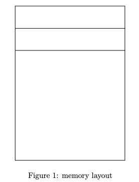

# Lecture 12: Midterm exam review 


### Objective

Review the course topics and content that will be assessed on the midterm exam.


### Lecture Topics

* [Exam Details](#exam)
* [What to Study](#study)
* [Practice Questions](#practice)

## Exam Details <a class="anchor" id="exam"></a>
* Paper exam
* __8 multi-part questions__ (10 points each), these usually ask you to review code and answer questions about the code or draw something like a memory diagram
* __1 coding question__ (20 points), must write code by hand, and draw UML diagram
* Total of 100 points
* 70 minutes to complete the exam


## What to Study <a class="anchor" id="study"></a>

__Other resources:__
[Unix Tutorial](http://www.ee.surrey.ac.uk/Teaching/Unix/)
* Read Tutorial 1 - 5
    - Change directories
    - Print current directory to terminal
    - List files
    - Copy files, including with wildcards (e.g. *)
    - Create directories
    - Change access control permissions for files and directories
    - Redirect output
    

__Text book__: [Programming Principles and Practice Using C++, 2nd Edition](https://richmond.primo.exlibrisgroup.com/permalink/01URICH_INST/191gg5k/alma9928032248406241) by Bjarne Stroustrup 

* Chapter 2 Hello, World!
    - Read Section 2.3 Compilation
    - Read Section 2.4 Linking
* Chapter 17 Vector and Free Store
    - Read Section 17.3 Memory, addresses, and pointers
    - Read Section 17.4 Free store (heap) and pointers
    - Read Section 17.9.1 Pointer and reference parameters
    - Read Section 17.9.2 Pointers, references, and inheritance
* Chapter 9 Technicalities: Classes, etc.
    - This is an excellent chapter
    - Please read the entire chapter

__Lectures__:
* Lecture 3 
    - Functions 
    - Strings
    - Command-Line Arguments 
* Lecture 4
    - Vectors
    - File I/O 
* Lecture 5
    - Memory
    - Pointers
    - Garbage Values
    - Memory Layout
* Lecture 6
    - References
    - Heap (Free store)
        * Allocation
        * Deallocation
* Lecture 7 
    - Classes
        * Class syntax
        * access specifiers (public, private, and protected)
    - Abstraction
    - Encapsulation
* Lecture 8
    - Constructors
    - Enumerations
    - Static members
    - Operator overloading
* Lecture 9
    - Scope
    - Friends
    - Destructors
    - Composition
    - UML Diagrams
* Lecture 10
    - Inheritance
    - Polymorphism
    - Virtual functions

    
## Practice Questions <a class="anchor" id="practice"></a>

### Pass by value, pass by pointer, pass by reference

Consider the following C++ code. 
* What will be the output of this code when run? 

__passby.cpp__
```c++
#include <iostream>
using namespace std;

void passByValue(float copyOfValue) 
{
    copyOfValue = 1234.567;
}

void passByPointer(float* addressOfValue) 
{
    *addressOfValue = 1234.567;
}

void passByReference(float& referenceToValue) 
{
    referenceToValue = 9876.543;
}

int main() 
{
    float value = 5551.212;

    passByValue(value);

    cout << value << endl;

    passByPointer(&value);

    cout << value << endl;

    passByReference(value);

    cout << value << endl;

    return 0;
}
```

### Memory layout



### Command line arguments

__args.cpp__
```c++
#include <iostream>

using namespace std;

int main(int argc, char* argv[])
{
    if (argc != 2) // argc counts the num of CLPs
    {
        cerr << "Usage: " << argv[0]
             << " <first name>" << endl;
        exit(1);
    }

    cout << "Hello " << argv[1] << endl;

    return 0;
}
```
Consider the C++ program __args.cpp__ above.
* You compiled the code: `$ g++ args.cpp -o args`
* What is the output of `$ ./args goodbye`


### Draw the State of Stack Memory

__swap.cpp__
```c++
#include <iostream>
using namespace std;

// Swap two int values.
void swap(int* a, int* b)
{
    int temp = *a;   // store contents of a in temp
    *a = *b;         // put contents of b into a
    *b = temp;       // put temp a into b
    
    // Draw the state of memory here <----

}

int main()
{
    int x = 12;
    int y = 33;
    swap(&x, &y);  // pass by pointer
    cout << "x == " << x << "  y == " << y << endl;
    return 0;
}
```


Consider the C++ program __swap.cpp__ above.
* Fill in the state of the stack memory at the location shown in the C++ code above marked `// Draw the state of memory here`.  Make sure to write in the name of the variable and the value of the variable. Use the memory address `0x123` for the address of `x` and `0x127` for `y`. Draw an arrow from any pointers to their associated value. Put the letter `G` in any squares that are __garbage values__ in memory. Each of the grid boxes is one byte of memory.  


### Access Specifiers (public, private, protected)

__Book.cpp__
```c++
class Book {
public:
    Book(std::string t) : title(t) {}

    std::string getTitle() const {
        return title;
    }

    void summarize() {
        std::cout << "This is a book titled: " << title << std::endl;
    }

protected:
    std::string title;
};

class Novel : public Book {
public:
    Novel(std::string t, std::string g) : Book(t), genre(g) {}

    void summarize() {
        std::cout << "This is a " << genre << " novel titled: " << title << std::endl;
    }

private:
    std::string genre;
};
```

Consider the C++ program __Book.cpp__ above.
* Describe the purpose of the protected access specifier in the Book class, and explain how it contrasts with the private access specifier.
* In the Novel class, which inherits from Book, can the summarize method directly access the title attribute? Provide a justification for your answer.
* If you create an object of the Novel class within the main function, can you directly access the title attribute from that object? Elaborate on your answer.


### Dynamic Memory Allocation and Deallocation

__Particle.cpp__
```c++
class Particle {
public:
    Particle(float x, float y) : posX(x), posY(y) {}

    void move(float dx, float dy) {
        posX += dx;
        posY += dy;
    }

    void printPosition() const {
        std::cout << "Position: (" << posX << ", " << posY << ")" << std::endl;
    }

private:
    float posX, posY;
};

int main() {
    Particle* p1 = new Particle(5.0, 7.5);
    p1->move(2.0, -3.0);
    p1->printPosition();

    // Some code here...

    return 0;
}
```
Consider the C++ program __Particle.cpp__ above.
* What does the new keyword do in the main function?
* As the code stands, there's a potential issue related to dynamic memory management. Identify the issue and explain why it's problematic.
* Provide a modification to the code to fix the potential memory management issue you identified.


### Polymorphism and Virtual Functions

__Media.cpp__
```c++
class MultimediaContent {
public:
    virtual void play() {
        std::cout << "Playing generic multimedia content." << std::endl;
    }
};

class Song : public MultimediaContent {
public:
    void play() {
        std::cout << "Playing a melodious song." << std::endl;
    }
};

class Video : public MultimediaContent {
public:
    void play() {
        std::cout << "Streaming a captivating video." << std::endl;
    }
};

int main() {
    MultimediaContent* content1 = new Song();
    MultimediaContent* content2 = new Video();

    content1->play();  // ?
    content2->play();  // ?

    delete content1;
    delete content2;
    
    return 0;
}
```
Consider the C++ program __Media.cpp__ above.
* What is the significance of the `virtual` keyword in the `MultimediaContent` class regarding the `play` method?
* Given the `main` function provided, what will the output be when the program is executed?
* Describe what is meant by the term `polymorphism` in the context of the provided code.


### Implementing the constructor and methods of a class

Consider the following C++ code in the file `Calculator.h`.


```c++
#ifndef CALCULATOR_H
#define CALCULATOR_H

class Calculator {
public:
    // Constructor: Initializes the calculator with a given value.
    Calculator(double initialValue);

    // Adds a value to the current result.
    void add(double value);

    // Subtracts a value from the current result.
    void subtract(double value);

    // Multiplies the current result by a given value.
    void multiply(double value);

    // Divides the current result by a given value. If the given value is zero, do nothing.
    void divide(double value);

    // Returns the current result.
    double getResult() const;

private:
    double result;
};

#endif
```

Use the C++ code above to answer the following questions.

* Write the C++ code that you would put into the file `Calculator.cpp` to implement the constructor and methods for the `Calculator` class found in `Calculator.h`. Do your best to write code that will compile. Remember to use `#include` as needed for external libraries or the `Calculator.h` file.

* Draw a __UML__ diagram that represents the `Calculator` class. Remember to include the name of the class, the member variables (attributes) and their type, and member functions (methods) and their return and parameter types. You should include the access specifiers for each attribute and method. If an attribute or method is `public` indicate this with a `+` sign. If an attribute or method is `private` indicate this with a `-` sign. 

